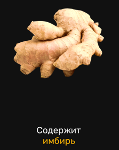

# Test Task for WillSkill

**Position:** Junior FrontEnd Developer

<a href="https://mordvintsevmv.github.io/willskill_test">Test App</a>

# <a name="content">Content</a>

0. <a href="#task">Task</a>

1. <a href="#features">Features</a>
   - <a href="#basket">Changing amount of items it Basket</a>
   - <a href="#card">Creating Cards</a>
   - <a href="#adaptive">Adaptive design</a>

2. <a href="#technologies">Technologies</a>

3. <a href="#contacts">Contacts</a>

## [Task](#task)

Develop a landing page based on the Figma layout using React, BEM, SCSS, semantics, adaptivity

[🔝Top🔝](#content)

## [Features](#features)

### [Changing amount of items it Basket](#basket)

The basket component has been designed so that it takes in the quantity of 
items and displays it. So, these components can later be used to dynamically 
display items in the basket.

**Basket Component:**

 ```javascript
    const Basket = ({items_num}) => {
    ...
   <text x="50%" y="70%" textAnchor="middle"
         className={items_num >= 100 ? "basket__items basket__items-extra" : "basket__items"}>{items_num < 100 ? items_num : "99+"}</text>
}
```
*Basket.jsx*

**Displaying:**

1 item:


More than 100 items:


[🔝Top🔝](#content)

---

### [Creating Cards](#card)

A Card component was developed to quickly create the same type of card.

**Basket Component:**

 ```javascript
const Card = ({top_text, bottom_text, img_url, upper = false, mobile_order = 0}) => {...}
```
*Card.jsx*

**It takes:**
   - top-text
   - bottom-text
   - img_url
   - upper (boolean) - large card or standard
   - mobile order - the order of the card when the page is vertical

**Example**

Standard Card:


Large Card:


[🔝Top🔝](#content)

---

### [Adaptive design](#adaptive)

The website design adapts to most types of screens.

To do this, SCSS mixins were used, which adapts the font, line height and width:

```scss
@mixin adaptive-font($maxSize, $minSize) {
   $diffSize: $maxSize - $minSize;
   font-size: calc(#{$minSize + px} + #{$diffSize} * (100vw / #{$maxWidth}));
}
``` 
*App.scss*

Media queries were also used to adapt the width of the screen and images:

```scss
.nootrisimg {
   
   ...
  @media (max-width: 550px) {
    transform: scale(0.33) translate(160vw);
    bottom: -405px
  }

  @media (max-width: 450px) {
    transform: scale(0.31) translate(200vw);
    bottom: -405px
  }
  ...
```
*Main.scss*

**Examples**

Standard page (1440px):


Adaptive page:


[🔝Top🔝](#content)

## [Technologies](#technologies)

- React
- SCSS
- HTML/CSS
- BEM-methodology
- JavaScript
- Media-query

[🔝Top🔝](#content)


## <a name="contacts">Contacts</a>

**TG**: @mordvintsevmv

**e-mail**: mordvintsevmv@gmail.com

[🔝Top🔝](#content)
